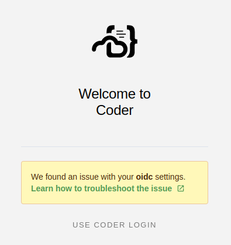

By default, Coder enables **built-in authentication**, though you can change
this if desired.

To do so, go to **Manage** > **Users**. Find the user whose authentication type
you want to change, and use the **Auth Type** to toggle between **Built-In** and
**OpenID Connect**.

If you opt for **OpenID Connect**, you'll need to provide additional
configuration steps, which are detailed in the subsequent sections of this
article.

## Coder's OIDC claims

Coder expects the following
[OIDC claims](https://developer.okta.com/blog/2017/07/25/oidc-primer-part-1#whats-a-claim)
from your OIDC provider:

- `email` (required)

- `name` (full name/display name)

- `preferred_username` (username for dev URLs)

You may need to map these to your existing claims within your OIDC provider's
admin console. If `name` and `preferred_username` are not provided, Coder will
derive both claims from the email address.

## Set up OIDC authentication

To set up OIDC authentication, you'll first need to register a Coder application
with your OIDC provider. During this process, you'll be asked to provide a
domain name for the OIDC token callback; use
`https://coder.my-company.com/oidc/callback`.

Once you've registered a Coder application with your OIDC provider, you'll need
to return to Coder and complete the setup process. Under **Admin** >
**Manage** > **Authentication**, ensure that you've selected **OpenID Connect**
as the authentication type. Then, provide the following parameters:

- **Client ID**: The client ID for the Coder application you registered with the
  OIDC provider
- **Client Secret**: The secret assigned to the Coder application you registered
  with the OIDC provider
- **Issuer** (e.g., `https://my-idp.com/realm/my-org`): The URL where Coder can
  find your OIDC provider's configuration document

> If you do not have values for any of these parameters, you can obtain them
> from your OIDC provider.

There are several additional configuration parameters that may be of interest to
you:

- **Enable Access Tokens:** Toggle **On** if you'd like to allow users to fetch
  tokens from `https://<yourDomain>/api/v0/users/me/oidc-access-token`
- **Additional Scopes:** Specify any scopes (beyond the default) that you would
  like Coder to request from the authentication provider. By default, Coder
  requests the scopes `openid`, `email`, and `profile`. Consult your
  authentication provider's documentation for information on which scopes they
  support.
- **Disable built-in authentication:** Choose whether Coder removes the ability
  to log in with an email/password option when you've enabled OIDC
  authentication

### Logging

If you're having issues with your OIDC configuration, you can enable additional
logging of OIDC tokens to aid in troubleshooting.

To do so, [update your Helm chart](../../guides/admin/helm-charts.md) and set
the `OIDC_DEBUG` environment variable to `true`:

```yaml
coderd:
  extraEnvs:
    - name: "OIDC_DEBUG"
      value: "true"
```

### Troubleshooting OIDC failures

If OIDC fails to configure, only an admin using the built-in authentication can
go into the settings and resolve the issue. All users using OIDC to authenticate
will be unable to login until it is fixed.



The admin must follow the
[Set up OIDC authentication](#set-up-oidc-authentication) steps again.

### Disable built-in authentication

You can disable built-in authentication as an option for accessing Coder if you
have OIDC configured.


To do so, navigate to **Manage** > **Admin** > **Authentication**. Then, toggle
**Disable built-in authentication** to **On** and click **Save preferences**.

[Site managers](users/user-roles#site-manager-permissions) can still use
built-in authentication. The **Admin Login** option will be visible on the login
page if built-in authentication is disabled.
